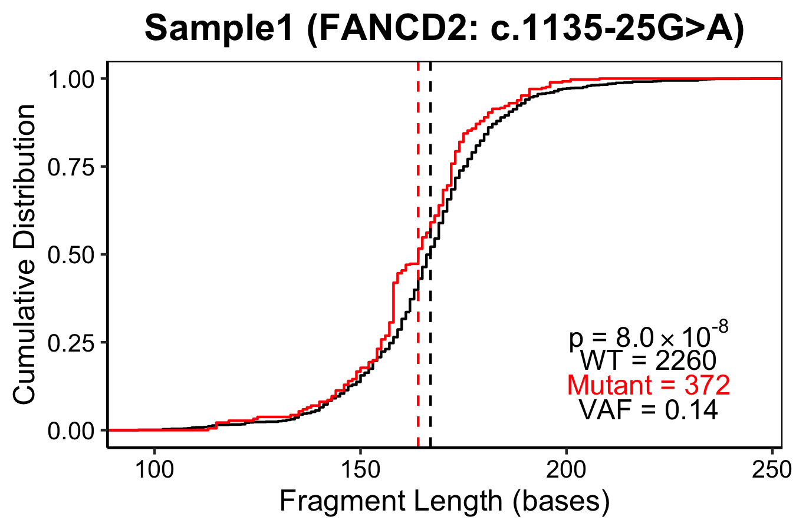

# PughLab CompareFragmentSize (version 0.0.13)
This package can be used to compare fragment size of variant- and reference-allele containing reads in a plasma cfDNA BAM file in order to classify variants as somatic (tend to have shorter fragments) or non-somatic (germline if VAF > 38%, CHIP or sequence artefacts). These functions are adapted from [Vessies et al. (2022)](https://github.com/DCLVessies/Fragmentomics).

## Installation
devtools::install_github("pughlab/CompareFragmentSize")

## Dependencies
This package utilizes functions from the following packages:
- GenomicRanges
- GenomicAlignments
- BSgenome.Hsapiens.UCSC.hg38 (BSgenome.Hsapiens.UCSC.hg19)
- Rsamtools
- Biostrings
- ggplot2

## Input Files
Target variants can be input in either MAF or TSV format. MAF format must contain these fields: Chromosome, Start_Position, End_Position, Reference_Allele, Tumor_Seq_Allele2, Tumor_Sample_Barcode (and optionally Variant_Type, Hugo_Symbol and HGVSc). TSV format must contain these fields: Chromosome, Start, End, REF, ALT, Sample (and optionally Variant_Type, Hugo_Symbol and HGVSc).

| Sample | Chromosome | Start | End | REF | ALT |
| --- | --- | --- | --- | --- | --- |
| SMID1 | chr1 | 1234456 | 1234456 | A | T |
| SMID1 | chr14 | 9872683 | 9872686 | - | ATCG |
| SMID2 | chr13 | 57244668 | 57244671 | ATCG | - |

## RUN example
The included compareVariantFragmentSizes.R can be used to run all target variants for a single sample:
```
Rscript compareVariantFragmentSizes.R -b /path/to/sample.bam -o /path/to/output/directory -s Sample1 -t /path/to/targets.maf -g hg38
```

| Sample | Hugo_Symbol | Chromosome | Start | End | Variant_Type | REF | ALT | HGVSc | Count_WT | Median_WT | Count_VAR | Median_VAR | KS.p | VAF | Classification | WTFS | VFS | ttest.p |
| --- | --- | --- | --- | --- | --- | --- | --- | --- | --- | --- | --- | --- | --- | --- | --- | --- | --- | --- |
| Sample1 | FANCD2 | chr3 | 10088239 | 10088239 | SNP | G | A | c.1135-25G>A | 2260 | 167 | 372 | 164 | 8x10^-8 | 0.14 | somatic | -1.23 | -0.16 | 8x10^-8 |


